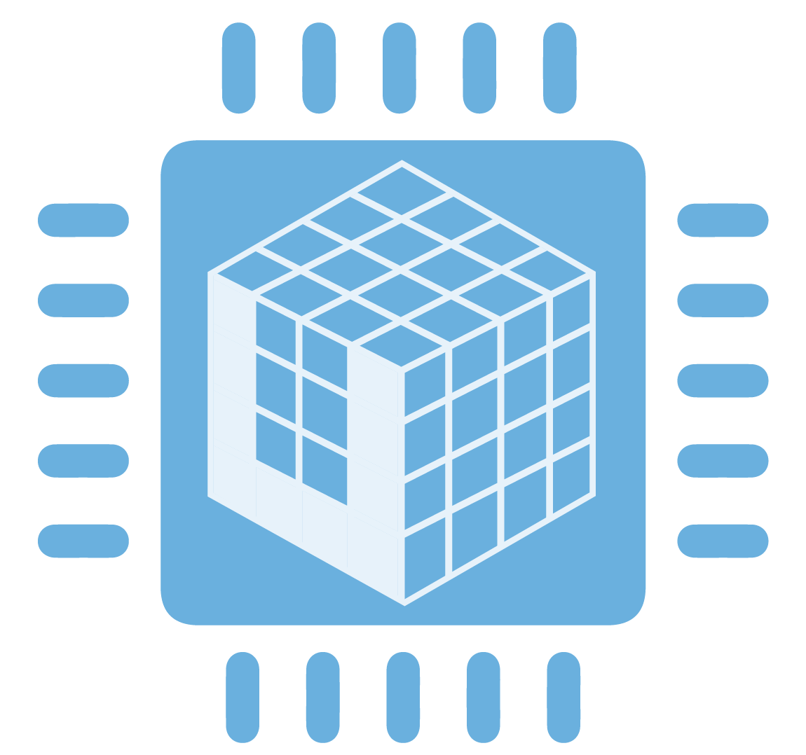

# `uarray` - A back-end mechanism geared towards array computing

   

- [Documentation](https://uarray.readthedocs.io/en/latest/)
- [Road Map](https://github.com/orgs/Quansight-Labs/projects/1)
- [Future Meetings](https://calendar.google.com/calendar/embed?src=quansight.com_cg7sf4usbcn18gdhdb3l2c6v1g%40group.calendar.google.com&ctz=America%2FNew_York)
- [Meeting Notes](https://github.com/Quansight-Labs/uarray/wiki/Meeting-Notes)
- [References](https://github.com/Quansight-Labs/uarray/wiki/References)
- [Papers](https://paperpile.com/shared/fHftX5)

## Contributing

See [`CONTRIBUTING.md`](CONTRIBUTING.md) for more information on how to contribute to `uarray`.
